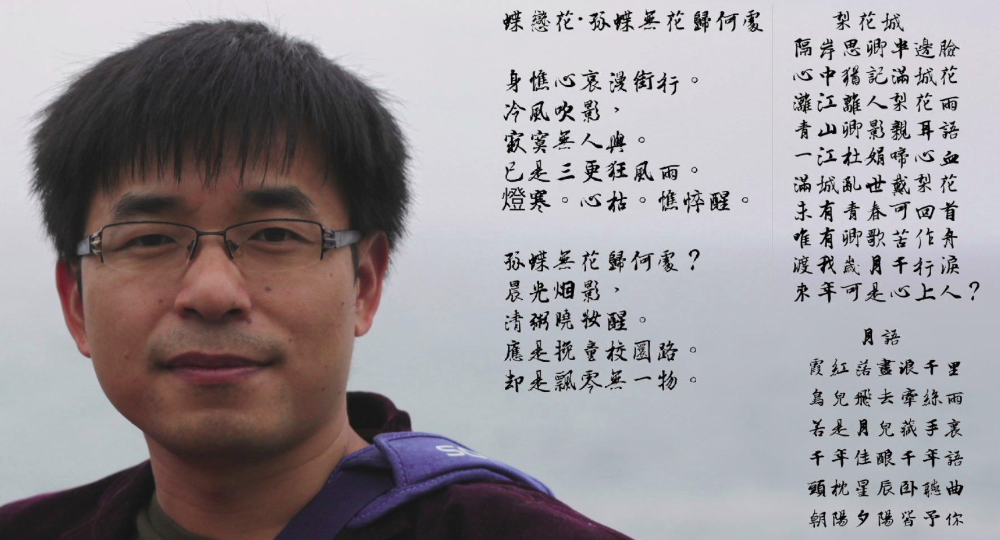
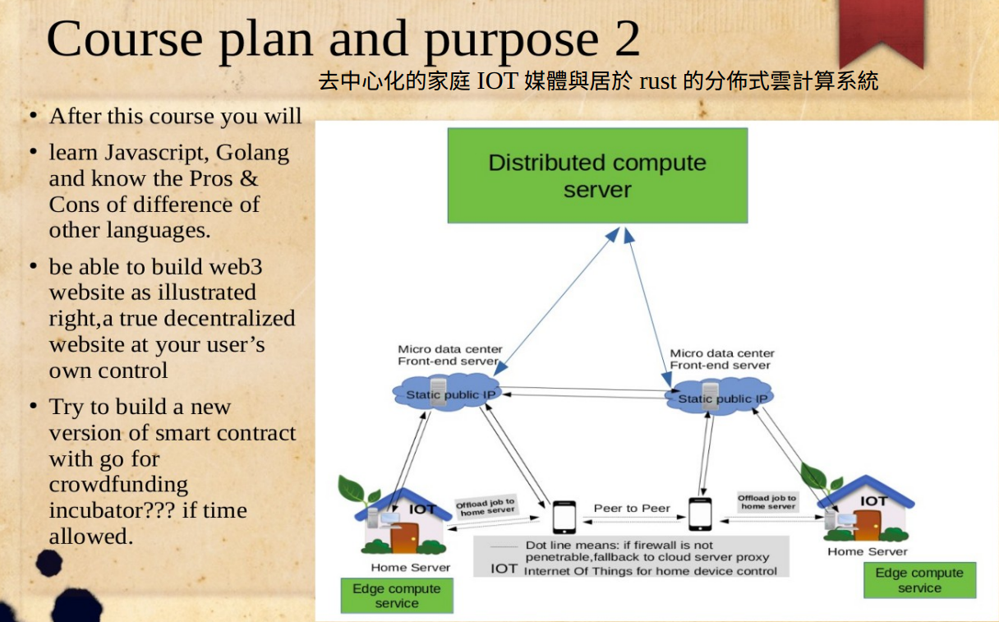
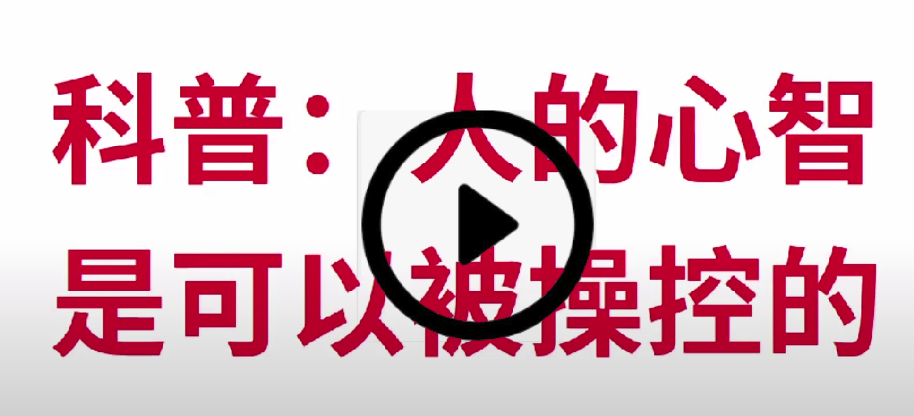

https://github.com/brianwchh/decentrialized-social-networking-software-system_1  DeCensorMedia,a decentralized social media
##### for political reasons I am not able to continue my startup in peace, so I decide to share my startup project knowledge,just in case it will be such a waste if it die with me.I am sharing this valuable project source code and tutorial for nothing in return but your "wake up" attention to what we Chinese have been suffering and what you will be suffering if you country becomes another version of "China" \ \ 
##### hope that good stuff meets the right person. 
### grassrootsstartup-ComputerVsion-zynq project sharing
### deploy computer vision algorithm on FPGA
-----------------------------------------------------------------------------------------
### demo of what you will achieve after this tutorial : \ 
#### https://youtu.be/avOE0U4dMCY
#### https://www.youtube.com/watch?v=se1tIy5UWpE

-----------------------------------------------------------------------------------------
### it includes : 
--- computer vision algorithm (stereo vision) algorithm design. \
--- deployment on FPGA (verilog HDL, modelsim simulation...）\
--- linux driver \
--- deep learning applications with 3D sensor \

### tutorial plan 
---Let’s read the papers together 

---Design algorithm on computer using C++

---System diagram design 

---Write Verilog code for each module & simulation 

---FPGA on-board debugging (zynq 7020)

---Embedded linux os bringing up

---Writing linux device driver 

---Design applications on arm and linux computer for demo

-------------------------------------------------------------------------------------------

## episode 1 : video tutorial list
https://youtube.com/playlist?list=PL4mHdDqV3T2uioDIKB7c27LtLq5Z4AETl

-----------------

- [點擊此跳轉至目錄頁面（雜文隨筆，編程技術教程，客家話學習等等）](https://github.com/brianwchh/worldofheart/blob/main/tableOfContent.md)
****
#### 博客精選文章目錄
* [無眠月照無情門](https://github.com/brianwchh/worldofheart/blob/main/md_and_html/%E7%84%A1%E7%9C%A0%E6%9C%88%E7%85%A7%E7%84%A1%E6%83%85%E9%96%80.md)
* [心學新解](https://github.com/brianwchh/worldofheart/blob/main/md_and_html/%E5%BF%83%E5%AD%B8%E6%96%B0%E8%A7%A3.md)
* [... 點擊此跳轉至目錄頁面（雜文隨筆，編程技術教程，客家話學習等等）](https://github.com/brianwchh/worldofheart/blob/main/tableOfContent.md)
****
#### 推薦文章
##### *_這篇文章比我在這裏分享的任何代碼和創業項目都重要，其中的發現關係到每一個人的方方面面。哲學比科學和技術更重要！哲學是人生，科學和技術只是喫飯而已！_*

#### 心智是可以被操控的！心智是可以被操控的！心智是可以被操控的！你所不知道的5G/6G微波腦機接口技術！ 
****
****
心学新解
****

阿柄

- [前言](#前言)  
- [真理與真相](#真理與真相)  
- [什麼是心學](#什麼是心學)  
- [心學理解容易相信難](#心學理解容易相信難)  
- [UFO是宇宙之矛攻宇宙之盾，是修改認知的關鍵](#UFO是宇宙之矛攻宇宙之盾，是修改認知的關鍵)  
- [UFO是外星人给我们纠正认知的信号](#UFO是外星人给我们纠正认知的信号)  
- [虛擬現實遊戲是虛擬宇宙的一種淺層體驗](#虛擬現實遊戲是虛擬宇宙的一種淺層體驗)  
- [佛學之心與相](#佛學之心與相) 
- [身相的控制模型：潛意識和心](#身相的控制模型：潛意識和心)  
- [再來理解神秀慧能的禪宗偈](#再來理解神秀慧能的禪宗偈)   
- [中國本是心學的國家](#中國本是心學的國家)  
- [宇宙的模型](#宇宙的模型)   
- [女性是文化的源頭](#女性是文化的源頭)  
- [一個真正的人間，應該有以下七個基本標準](#一個真正的人間，應該有以下七個基本標準) 
- [全球主義的單極世界深層政府是文明的墳墓](#全球主義的單極世界深層政府是文明的墳墓) 
- [知行合一](#知行合一)
- [世界非如我們所見](#世界非如我們所見)
- [既來之則安之](#既來之則安之)
- [情緒是一種選擇](#情緒是一種選擇)
- [活着的意義](#活着的意義)
- [生活需要哲學和信念](#生活需要哲學和信念)
- [人生是一場遊戲](#人生是一場遊戲)
- [幾首不成詩的文字](#幾首不成詩的文字)  
        - [月語](#月語)  
        - [梨花城](#梨花城)  
        - [蝶戀花.孤蝶無花歸何處](#蝶戀花.孤蝶無花歸何處)  
- [視頻簡介](#視頻簡介)  

#### 
 

#### 前言

*_落難程序員分享一篇哲學感悟。本不善言辭，花了不少時間，傾盡僅有的文學所能，希望文字能入君心，一起渡人渡己。_*    

我目前情況：如果你看我簡歷：我是個有13年工作經驗的資深軟件工程師，但我現在被逼着要飯，我急需一份線上遠端工作，或是正職的工作，這是我簡歷：https://drive.google.com/file/d/1prTooDjUplhFeollKSnH-0_06FcaKMGh/view?usp=share_link 。我的email: brianwchh@gmail.com （我不可能不回覆，如果沒回覆，唯一的解釋是我的email被做了手腳！）.期待好心人的幫忙！也希望你能稍微花點時間看完下面這篇文字，我盡可能去傳播發現的真相，是因爲我相這世界還有很多人不知道真相！我堅持，是因爲我不服輸！而且只要還活着，我會盡我一切可能去傳播。誠摯期待各位的幫忙，非常非常謝謝！   

*_一張舊照片，記錄下落難之前的自己,拍攝於2018年春節於深圳盐田海滨栈道。順帶附上幾首不成詩的文字，理科生書到用時方恨少，請輕輕拍，也歡迎高人來信批評指正，brianwchh@gmai.com 謝謝。_*  

*_前途不知曉，只剩孤獨回憶心間撓，想自由，唱自由，也想清淨田園無人擾，也想如你們，回到過去，安安靜靜，繼續着美麗的創業夢，更想僅剩的青春裏有你，把你畫進我自信的歲月長廊裏。_*  

#### 
 

#### 真理與真相  

*_真理就是真相需要原點。就像每個座標系中的座標需要原點一樣。_*    

若原點在虛擬遊戲的世界裏，那麼遊戲人物角色所見之世界即爲真相，而其無法看見的“電腦”外的真實世界就是未知與不相信。  

若原點在遊戲玩家的世界裏，那真相就是遊戲玩家所見之世界，而遊戲角色之世界即假相。未知就是遊戲玩家世界之外的世界！  

**_所以真相是相對的！這世界沒有絕對的真相！就像沒有絕對的座標一樣。_** 相外有相，天外有天，天不一樣，世界的物理和規律也不一樣。  

認知不取決於你能看到什麼相，而是取決於你能通過相悟到什麼！眼見不一定爲實，有可能皆是幻相，只是我們從一出生就習慣了把原點設在自己世界裏，就像我們習慣了我們的認知裏氧氣是無味道的一樣。  
 

#### 
 

#### 什麼是心學  

什么是心学！心学就是認知宇宙與生命本质的哲學，并以之指导人生，以及构建有文化的社区和国家！  

通过这篇文字我希望你们也能和我一样，有一种顿悟的喜悦！我也相信，这种方式讲解心学是最好、最通俗易懂的诠释方法！当你回过头来再读佛经中所说的“若见诸相非相，即见如来”，“我不入地狱谁入地狱”，以及《圣经》所言“人生而有罪”等这些文字时，或許就能瞬间相信了！    

我们大概都听过王阳明及其心学，但鲜有人了解心学及其重要性！究其原因大概是古人的讲述过于抽象！像佛法一样，对悟性有一定要求！也可以理解，因为古代没有现代科学的工具来帮助形象理解！  

#### 
 

#### 心學理解容易相信難

心学是集儒学、佛学和道家智慧之大成。但要让普罗大众相信心学所言，必须要有UFO的帮忙！此话怎讲？

#### 
 

#### UFO是宇宙之矛攻宇宙之盾，是修改認知的關鍵

因为确信了UFO现象，那宇宙为空（即虚拟）无疑了！詳見以下分析。    

人类是容易盲目从众，和相信权威的动物。大部分人都容易害怕认知上的离群孤单，害怕被嘲笑，也容易被之激怒失去冷静理性和自信！

先来一个民主理想之国美國的权威报道！为何称之为理想之国，因为大家都这么说，所以就成了理想！雖然民主離人類很遠，但美國的確是當今做得最好的一個國家。  

2022年上半年，美国国会举办了UFO的听证会，距上一次是50多年前。这次听证会，以官方名义证实了一些网上流传的影片是美国军方拍摄的真实UFO現象！但其现象无法用目前人类的科技解释！而且是明顯違背物理学常识！比如其任意轨迹飞行和消失，更不跟空气與海水发生任何作用，也没有声音。这只有唯一一个合理解释：我们这个宇宙是外星人构建的虚拟世界！我们是他们世界中的一种程序的存在！宇宙外面的世界超出了我们目前人类的认知！就像蚂蚁的智商无法认知我们的世界一样！  

只有宇宙是空的，是外星人的虚拟现实的游戏，UFO才能超越权限无视这个宇宙的物理规律。我们这个宇宙的物理规律和外面真实世界的物理规律可能完全不一样。我们不应该站在蚂蚁的角度去理解人类世界，同样，我们不应该站在人类智商的角度去认为宇宙就是我们观测到的模样！应该更多地以一种超越蚂蚁的方式去探索。  

我们人类是一个永远无法知道自己是什么的存在！  

真相只能无限地接近，卻无法完全了解！因为我们被有意抹去了一些记忆，所以有些真相我们永远不知道。我们不知道自己的源头，但源头的源头可能还有源头。人类有智商，是优点，也是缺点！因为有智商，所以容易被忽悠和操纵！可笑的是逻辑上多转几个弯，人類可能就不如猪了，比如经济学教科书上一本正经谈的通货膨胀！書上一本正經地說钱是衡量价值的直尺，然后通货膨胀告诉我们说，这直尺和男人的那个一样，初一十五不一样长。这不是人类智商的笑话，那是什么？！谁会去商店买这样一个直尺来丈量东西！？我们知道抢劫银行的有罪，唾弃之，却对躲在金融背后的西装革履顶礼膜拜！眼看着钱几十年逐漸贬值幾十倍！卻沒有一點感覺！  

这种一点一点沒感覺的刮肉微疼不叫疼，而是痔疮痒！青蛙在温水中的热也不叫热，而是小火慢炖！  

#### 
 

#### UFO是外星人给我们纠正认知的信号

我们的认知是认知本身最大的障碍！  

我们的人生就是一个不断修改认知的过程，并以之为指导去改造世界和生活！  

我們無法把頭伸出這個宇宙的超級電腦去看看外面真實世界的模樣。UFO現象是唯一一個人類觀測到的外部世界的間接數據。

另外，集體潛意識，已經是一個在心理學上被證明的科學現象。一羣在孤島上的動物能發展出和內地的同種物種一樣的習慣。這也證明了，人類的大腦在另一個我們不知道的維度，以某種方式共享着某些很重要的東西。而這維度也只能在這個宇宙之外！如果宇宙是一臺超級超級計算機，而我們的心在這宇宙之外，以某種方式共同接入了這個宇宙超級計算機，那就能很好地解釋潛意識的現象了！即我們共享了一些知識等等。

#### 
 

#### 虛擬現實遊戲是虛擬宇宙的一種淺層體驗  

玩過虛擬現實眼鏡的人，大概都可以感受到僅有視覺信號的虛擬世界已是多麼逼真了！

比如過山車的VR體驗，其加上身體的左右上下運動和旋轉，那種身臨其境的感覺會更加逼真。如果把觸感和其他所有的感官和感受信號都和視覺圖像一樣轉變成一種沉浸式的腦電信號，那麼我們身體不用在原地左右上下動，只需靜靜地躺着，也能有那種失重等等感覺。理論上，人只要靜靜地躺着，甚至不需要身體，只需要一個活着的大腦，他/她就能用生物電信號在大腦中形成宇宙和經歷逼真虛擬世界的一切生活日常。 

 

> ##### 所以有禪句曰：不是風動，也不是旗動，而是心動！  

 

因爲風可以不存在，旗子也可以不存在，造物主只需給你生物電信號，你就能在腦中（宇宙之外的心，非心臟）形成一種身臨其境的看風吹，看旗動，看雲卷看雲舒的代入情景！  

你或許會說，這好像是某個電影情節，我不去爭辯，只是別人拍電影比我悟出來的早，不代表我在用它來忽悠人，另外忽悠人也的有好處才有動力！再讀下去，你會發現，電影它不是在啓蒙你，而是在誤導你，有很多關鍵的信息沒打算讓你知道，反而是把人引導道什麼基督啊，和神的（全球主義者的）單極世界大政府方向走！看完電影，反而基本上沒有人會相信這是真的了！就像UFO事件一樣，沒有政府出面，根本很難有人相信是真的！再者，CIA常用的打擊爆料者的手段就是抹黑爆料人，讓他/她成爲笑話，就像我們很多人嘲笑川普先生一樣。上帝最好的加密方式不是靠什麼複雜的算法，而是塑造人的認知，製造一大堆的似是而非的假信息，或者拍電影，或者動用宣傳工具來嘲笑讓人不敢相信之，然後把真相放你面前，你都不會相信！  

僅從地球科學來看，neuralink公司已經證明了，無線人機接口技術是存在的，而我們也只看到了冰山一角！大腦信號不僅可以被外界讀取，還能寫入，就像給機器人指令，它完全無法區別是自己的心智決定還是上面的信號輸入！我們聰明的人類能想到且做到的技術，難道外星人做不到？此刻真正的我們或許在某個現實的囚牢裏，四肢不得動彈，大腦接入外星人的超級電腦形成了我們當下的所有一切！  

因爲我們在這虛擬的宇宙裏玩遊戲上癮了，就像井底長大的青蛙，以爲天就是它所見到的！我們只被輸入了允許輸入的信號，所以以爲這就是宇宙！

#### 
 

#### 佛學之心與相   

我們從唯物主義的科學裏找到了唯心主義的真理！  

我們談的不是神學宗教，而是佛學心學！  
 

> ##### 《金剛經》有雲：凡有所相，皆是虛妄。若見諸相非相，則見如來。  

 

這虛擬的宇宙之外的信號受體就是我們的本我，也叫心，也叫佛，也叫如來。在虛擬宇宙之內的那個你我，稱之爲相。《金剛經》說“可身相見如來否？”，答案是否也，但每個身相之後都有一個如來，你如果真確地領悟到了“所見諸相非相”，身相之後的如來就存在了，你的本心就醒了，如來和佛在梵文裏皆指開悟者，不是什麼沒有生殖器的神仙！  

所以如來說，衆生皆具有佛性！  

#### 
 

#### 身相的控制模型：潛意識和心  

電影可以誤導你，給你科幻的快感，讓你更加自信地沉溺於虛擬宇宙的虛擬遊戲中，醉生夢死紙醉金迷，來世今生不停地在這裡輪迴，樂不思蜀！這就是宇宙之道超級管理員樂於見到的。  

但電影沒有告訴你的是： ***_我們人的心智是可以被操控的！即腦控。_*** 看看下面這只老鼠無比威猛的做愛能力，你就可以知道了。它完全意識不到輸入信號的存在！它完全以爲它以爲的就是它以爲的！它完全可以在老鼠羣中驕傲地宣稱：它可以做遍天下愛無敵手！  

視頻鏈接： https://www.bilibili.com/video/BV1Pv41147z8/   
https://www.bilibili.com/video/BV1Ti4y1M7sG/  

我們這宇宙本來就是腦控的產物！

人也可以像那隻老鼠一樣威武，有一句歌詞這麼唱的：you raise me up！你只要祈禱，像相信撒旦一樣，把一切交付於它，那位超級管理員，它要是覺得你有用，就會挑中你的。這種超能力無非就是給虛擬宇宙之外的那個本體之你一點作弊的信號唄，這樣你就能讀別人的大腦，能知他/她腦中一切過往和當下，還能有所謂的浪漫的心靈感應。

經歷過或者瞭解腦控的人，都應該很容易理解我所說的！  

*_關於5G/6G微波腦控存在與否及原理，我後面會簡單談及，但你一定聽過 **_軍方的微波武器_**，以及用微波武器來驅趕示威人羣，讓他們頭暈嘔吐。**_微波是電磁波，如何能成爲武器呢？其實就是它能和大腦通信。到這裡，應該都相信微波腦控的存在了，_** 但我個人覺得，局遠不是那麼簡單，網絡上討論腦控是否真實存在，其實是爲了掩蓋_* **_宇宙本身就是腦控的存在_** 之事實，只是這種腦控不是通過微波信號。在虛擬世界裏僱傭一羣拿不出證據的人，甚至有些是低級黑，來宣稱自己被腦控了云云，讓人一看就像是腦子不正常或是什麼心理疾病，而且還傳播的特別廣！太有宣傳能耐了，我們這些講真話的人，信息卻被包圍得死死的，說的話傳不到幾個人心裡。  

污名化和改變大衆認知是最好的保密方法。答案放你面前，你都不敢去相信！

微波能和大腦通信，這是這個宇宙里的事實，微波武器證明了這個事實的存在。**_但微波和大腦通信的科學卻又是用來掩蓋人類和宇宙本質就是腦控的真相！ 以虛擬宇宙內的僞科學來掩蓋宇宙之外的真實存在。_** 不過即使沒經歷過微波腦控，沒瞭解過它，也應該不難理解這虛擬宇宙模型和人體控制模型。  

那個神或者說是撒旦，這個宇宙的超級管理員，控制的是人體的潛意識，諸如情緒慾望等等快感的領域，而我們的本心（佛）的領域是自我剋制的心的領域，即快樂的領域。所有的感覺信號，只有經過心才能體悟到快樂！想要成魔，跟着它走，有能力也有一切物質很有爽的快感。想要成佛，跟着心走，會辛苦，但很快樂！  

很多時候，我們所做的決定其實不是我們自己做的。尤其是基於快感慾望的，或者我們不明全局時，我們做的決定就像是殭屍一樣被潛意識牽着走！老子《道德經》雲：道作用於萬物，而萬物不覺察之。就是這個意思。道就是這個宇宙虛擬機。它安排着萬事萬物，從起心動念到出生消亡。道是中性的，亦正亦邪！  

明白道和人的控制模型，我們就知道如何修心了！我們來世界的使命是修心覺悟，渡人渡己，然後脫離六道輪迴。爬過黃山知天下無山可爬。我們被抹去了入宇宙之時的記憶，又怎知宇宙之外的真實時空如何？所以，此生不管悲也好喜也好，苦也好，樂也罷，不管今生來世的世界如何變幻，都只是修心的舞臺，我們是帶着修心的善的使命來渡更多的心也渡自己的目的來改造相，而不是被相左右，變成沉溺於虛擬遊戲中，一味追求帶不走的虛像財富！我們入世，或被迫或主動，既來之則安之，在夢裡完成自己的使命，通過相來影響生命，影響心，即渡人渡己，修心成佛！只有明白修心，我們這一生才不會輕易迷失，才能活的通透和快樂！  

如果修心的人越來越多，那集體潛意識就會趨於變善。人的潛意識不是完全孤立的，比如有些動物的習性，遠在某個島上幾個世紀老死不相往來的動物，可以和內陸的相同動物羣變的相同。這就是集體潛意識在起作用！也只有在虛擬宇宙之外維度的信號才能做到！  

#### 
 

#### 再來理解神秀慧能的禪宗偈

神秀：  

身是菩提樹，心如明鏡臺。  
時時勤拂拭，勿使惹塵埃。

慧能：  

菩提本無樹，明鏡亦非臺。  
本來無一物，何處惹塵埃。  

現在再回來看這歷史上有名的禪宗偈句，應該很容易理解且相信了！  

菩提是梵文bodhi的音譯，指智慧，如同睡醒的頓悟覺悟，佛在梵文中指覺悟者。神秀說的身指的是虛擬宇宙中的身相，心雖然不是心臟，但他以爲此心依舊是此宇宙中的實體，需要在乾淨的社會人羣環境中修心，使之乾淨。但佛是塵世人，離開塵世各種酸甜苦辣鹹的人生經歷怎能成佛，和尚是成不了佛的，就像法海不懂愛一樣，他們應該像王陽明先生怒斥的那樣，回家孝敬父母結婚，做到修身齊家平天下，嚐盡人間煙火。慧能說身相是空，心也是空，不在這個宇宙，但卻沒說佛是這虛擬宇宙之外的存在。  

#### 
 

#### 中國本是心學的國家

不像西方多數國家，中國是一個不是靠宗教立國，而是靠文化立國的國家。只是某些邪惡勢力一直在意圖滅文化立宗教，以期用宗教統治全世界！古代的文化主要是規範人的行爲，使人有自我約束，以區分於野獸和未開化的野人。儒家的精髓在《大學》裏有很好的概括： ****_修身齊家平天下_**** 。只是人類社會總有人惦記着“統治”兩個字，於是有了爲統治而生的禮學版的儒家，廣傳至今，影響了許多亞洲國家。在當下的日本和韓國還能見到其影子，也成了他們文化的一部分，比如敬語，比如日常的許多習俗，可惜的是這些在中國卻慢慢消亡，一番胡言亂語的野蠻征服文明之後，禮也沒了。但禮學版的儒家，不注重心，只流於形式。雖然也有唯物的理學，但中國在自然科學方面並不強大，然而科技不是文化的組成部分，只是保護文化的戰馬，中國的文化之所以會走向衰敗，就是因爲屢次被野蠻征服，古代的時候，是騎兵不如人，因爲馬瘦小，沒法形成像金兵那樣的全副盔甲的騎兵。然而科技畢竟不是人類的出路，它只會誤導人類進入相的迷途！但我們又必須要有科技來保護和傳承修心的文化！自王陽明等人之後，中國集儒學，佛學和道家發展出了很好的心學，卻可惜沒有得到很好的推廣！  

迴歸心學，不僅是中國，而且是世界都該選擇的方向！因爲我們來這個世界的使命是用相修心，渡人渡己，而不是追相離心！  

#### 
 

#### 宇宙的模型

何爲魔？何爲神？何爲佛？何爲心？何爲道？何爲道生一，一生二，二生三，三生萬物？何爲我不入地獄誰如地獄？何爲科學？何爲平行宇宙？何爲宇宙的維度？何爲三六九？何爲耶穌，他是人還是神，還是克隆人？《聖經》是不是一本流傳幾千年的愚弄人類智商的笑話？  

鑒於人類是被抹去記憶的存在。真相之於人類就是不斷修改和無限接近的認知！真相與認同的人數無關！  

大道其實至簡！道即宇宙，即造物者，在外星人的維度，即類似一臺人類的電腦，只是其性能遠不是人類能想象的！  

《聖經》說：人生而有罪！不是因爲做了愛被趕出伊甸園。而是暗指我們是被迫或者主動以某種方式接入道這臺外星超級計算機的外星人。我們入宇宙非常類似於進行一場思想改造運動，以玩虛擬遊戲的方式，只是宇宙中的身相（人）非常難覺醒和發現這一真相！我們在這宇宙中不斷地六道輪迴，直到我們修心圓滿，最終在這道外獲得自由！外星人就是佛，即合格的心！  

這個道作用於接入其中的萬物，而萬物卻不覺知！如前面人（身相）的控制模型裏提及，人受道控制（潛意識）也受心控制。這其中的鬥爭就是修心，就是佛與神的鬥爭。人不用心，或者不知道如何區分對錯時（這也是爲何他們喜歡攪渾水的原因），人大多時候都是被道控制的殭屍或者是喪屍！只要用心觀察，那個無時不刻在腦控你的道，會以某種方式跟你打招呼，或者迴應你！但人生不盡是《楚門的世界》，還是有選擇的！天有天道要循，而且天外亦有天！  

道生一，一即是神，或者死神，或者稱其本名魔鬼，是這個道的超級管理員。  

一生二，二即爲人類，有心的身相！  

二生三，三爲無心的相，克隆人，鬼，或者是道創造的“機器人”，他們直接受神的領導，管理世間萬物，經常的死亡方式是心梗死，如果不廳使喚的話！他們生前是人，所以也可以稱爲鬼，或者說是像小灰人一樣活動在這宇宙的外星人。俄羅斯前總理說，外星人一直在我們人羣中，我們卻很難發現，指的就是這個。里根總統也曾在聯合國大會上提示過外星人在我們人羣中的存在。這種有超能力讀腦的人是真實存在的。耶穌就是克隆人的玩笑！紅海一分爲二，以及耶穌的超能力表演，其實就跟UFO的表演是一個信息！這世界是虛擬的遊戲！在遊戲裏有無限的可能的神蹟！  

三生萬物，指其佔據着各國國家關鍵的崗位，控制着這個世界！因爲他們最終目的是消滅各國政府，取消邊界，讓全球主義者控制的單極世界政府實際掌控這個世界！他們的標記是三角形！在美國的貨幣上好巧有！  

關於三六九，在中國向來有天圓地方，天公地母之說，屈原也有《九歌》，九一直被用於指代天，即所謂的神，如果熟悉OpenGL做遊戲渲染的話，金字塔剛好是九個頂點，四方形六個頂點，萬物皆可以由三個頂點渲染出來，可以當着是一種很好玩的巧合，也就是所謂的三六九就是一個虛擬世界的遊戲。
何爲佛說：我不入地獄，誰入地獄！其實我們這宇宙就是外星人眼中的地獄。很多佛是自願來這個世界喚醒人心的。只是魔控制了世界的方方面面，這場鬥爭自然也異常艱難！  

何爲科學？這要看以什麼現象爲研究對象！對於道這臺超級計算機外的世界，我們沒有數據，所以沒有科學。我們只有道內的僞隨機數據，我們人的智商根本洞察不出這些自然現象是僞隨機，很多預言之所以後來實現了，也可能道早有一本寫好的概率天書，萬物所有的選擇的全概率樹，早已經算好了。我們只是不知道而已，以爲所有的當下都是隨機！連川普所支持的Q覺醒運動也說：這世界沒有偶然，只有安排！我們在這道的僞隨機數上得出的無限逼近就是人類科學！如果說科學家就是真相家，那就是高級冷笑話！我們以科學的方式學習僞科學，是爲了以其矛制其盾探索真相！並以之幫助改造相，以幫助修心！而不是沉迷於相中！玩遊戲，勝負不是關鍵，修心才是！  

宇宙的維度和平行宇宙。宇宙的維度，不是中空間的二維或是三維。這個用計算機的術語來幫助理解，或許比較容易。如果最高維度的宇宙是真實的計算機實體，那次一層維度，就是其上安裝的虛擬機，然後再次一層宇宙就是虛擬機中的虛擬機。然後每一個虛擬機其實有可以並行安裝很多虛擬機，比如你可以同時運行Linux和Mac，這種並行安裝的虛擬機就是平行宇宙。在這樣的維度裏，到那一層，我們才是真正的醒來？  

真理就是永遠保持對未知的敬畏！修心沒有止境，因爲你可能永遠不知道真正的心在哪一個維度！

  

##### 神與魔  

魔鬼說  
我把殺戮真實地呈現給你  
所以你有了從善和作惡的選擇  

神說  
我把殺戮寫成詩篇和神話  
變成你們童年的牀頭故事  
所以有了你們浪漫的人間  
我提醒你們魔鬼的模樣  
這樣  
你們再也不必擔心會碰到了  

   

#### 
 

#### 女性是文化的源頭  

一個社會是否有文化，就看他們如何對待女性！問問你從哪裡來的？然後在摸摸你的心，是否該把你媽的那個掛你日常的嘴邊！甚至胡言亂語寫進讚美和貶損的句子，才足夠表達動物的情緒！？  

#### 
 

#### 當代的金融體系是個局  

其目的是全球主義和世界單極大政府！這是文明的公敵！金錢的直尺是不能伸縮的！拒絕通貨膨脹的痔瘡笑話！金融和文化一樣，都容易被神棍用來忽悠人！  

#### 
 

#### 一個真正的人間，應該有以下七個基本標準：  

1. 去中心化的真正信息自由  

2. 限制資本，不能讓其成爲慈禧  

3. 約束宗教團體，不參合政治，不參合資本，即（政治，宗教和資本）大三權分立！以文化修心爲主，宗教撫心爲輔。  

4. 政治三權分立  

5. 這點最重要，一定要以心學爲第一位！ 心學是解決人生和社會問題的根本！ 儒家禮學在日本和韓國紮了根，在中國卻斷了根。但文化禮教少了心是不夠的，多的是禮多而無心！心學的修心才是這個世界是煙火人間的根本之根本！  

6. 堅決不搞單極政府，不管是世界還是國家！  

7. 反對和制止人腦科技和克隆技術。順應天道，不做僞神去改變自然世界！廢除微波腦控，禁止微波組網，限制人工智能，制約工業化！尊重和接受人類的不足！敬畏生命！順應天道，而不是用科技去逆天道！  

#### 
 

#### 全球主義的單極世界深層政府是文明的墳墓

資本坐莊的資本主義弊端是：大衆看不到真正的屠夫在用資本控制着世界！這個才是近百年來不倒臺的皇權，而且是世界單極的皇權！不受制約的資本主義是一個豬羣人類社會的坑！全球主義是它們的外衣！其最終目標是消滅各國政府，形成單極的政府。用5G/6G 微波腦控管理全人類。這比共產主義還恐怖！  

#### 
 

#### 知行合一

知不易，行更不易。相對於行，知太容易，行太難。不要看一個人說了什麼，而是看其做到何程度！這大概是我們的通病。行一陣子容易，踐行一生卻非常難！  

#### 
 

#### 世界非如我們所見

認知是認知本身最大的障礙！  
認知是認知本身最大的障礙！  
認知是認知本身最大的障礙！  

我想抱着你的大腿，求你放空以前的固有認知和偏見，求你做一回悟空，耐心地把這篇文章看完！因爲覺醒對每一個人都非常重要！這是我們人生的真正使命！我們有義務必須去喚醒每一個人！我們人類是被深度洗腦的生物！我們被一層又一層的謊言包圍着！我們很多的認知是錯誤的！謊言被無數人重複就變成了真理和習慣，甚至偏見！我們的智商之於操控我們心智的外星人一樣的存在連螞蟻都不如，我們在嘲笑螞蟻其實也是在嘲笑無知的自己！我們應該有敬畏的謙虛，不應該以螞蟻的角度去看待人類一樣去看待這個未知宇宙，我們的單線程的智商可能無法理解真正宇宙的規律。我們就是太自負自己的智商才以爲我們所見就是真實的宇宙，而不是被植入的信號！做過虛擬現實VR眼鏡，就知道如何超級逼真地生成眼見爲實的影像投影！  

這世界沒有偶然，只有我們沒覺察到的安排。如果你需要權威才能相信，可以去瞭解下川普在一次記者會中比劃的Q覺醒組織的手勢，Q也說這世界沒有偶然！很多你以爲的你以爲其實並不是你以爲的，人類的心智是可以被操控的，就像機器人無法分辨輸入的向左或向右的指令是外部輸入的一樣，這點可以看看這個很具有代表性的心智操控視頻，然後你再悟一下就明白了。https://www.bilibili.com/video/BV1Pv41147z8/ 視頻中老鼠一直以爲其一日無數次郎的超強性能力是自發的，但實際確實被一根光纖信號控制着它的心智（潛意識，情緒，慾望等）。  

我們這世界是虛擬的！我們一直都在沉睡中！被抹去記憶的我們不知道這虛擬宇宙之外的真實世界！我們很多人也並不是第一次來這個世界！  

我知道這很難讓人相信！換着以前的我，我也不信。我甚至會認爲自己被宗教洗腦了！但如今的我是不信宗教的，雖然我來自傳統佛教國家，但佛教其實不是宗教，佛教是無神論的。讀過佛經，只需讀《金剛經》和《心經》，你就會明白佛法和佛教不是一樣的。宗教本質是披着謊言外衣的統治術！如來在梵文裏的本意是覺醒覺悟者，而不是什麼神仙！這世界有一股隱藏的勢力在污名化佛法！佛學修心是正道！  

而王陽明先生的心學是集儒學、佛學和道家之大成的哲學文化！是真正探知宇宙和生命真相的科學。我們這個宇宙就是道，如道家所言，作用於萬物，而萬物卻不覺之。這個道是外星人的超級計算機，虛擬數據vs真實宇宙（我們人類無法獲得真正的數據），而我們這個所謂的物理科學，卻是根據虛擬宇宙中的僞隨機數據形成的一種數學逼近。**_科學是一種研究探索問題的方法，和哲學一樣，而不是數學公式和結論！_** 在不同的宇宙觀測到的僞隨機數據不一樣，用同樣的研究方法，得到的數學公式肯定也不一樣。但科學背後的哲學思維卻是一樣的。你要是沉迷於道中的僞隨機數據，你就是沉迷於超現實的遊戲當中不願意醒來了！  

這篇文章宗旨就是希望每個人都能真正覺醒！醒來兩個字很簡單，但可惜的是，我絕大多數人都沒真正醒來！  

我是學物理的，做了十幾年前沿科技的軟件工程師，主要是深度學習，機器視覺和無線通信等方面的算法及其硬件加速實現，這裡有我的項目開源分享：https://github.com/brianwchh 。 我自己對覺醒的難度深有領悟。我深深明白，心學對一個人，一個社區，一個國家，乃至整個人類都麼重要。也似乎明白爲何弘一法師會毅然放棄優渥的物質生活，剃度出家入戒律最嚴的寺廟去苦行，或許他也是看到了佛學修心是當下社會的根本解救之道。  

#### 
 

#### 既來之則安之

我們來到這個虛擬宇宙，或許有選擇，或許無選擇，既來之，則安之！  

宇宙這個道確實很美，其中科學也很有美感，學習科學技術應是享受其中的美，我本人很享受算法和編程實現的藝術美感以及成就，但更重要的是感受修心過程的快樂！知其相而樂其相，但不迷失於相！更沒有意義在相中作惡！  

宇宙的智商遠遠在我們之上，可以說是個超級魔術師。甚至可以說，一個人一個宇宙，也是可能的。無非是一個超級逼真的沉浸式遊戲嘛，就像人在休眠一樣，道這臺超級計算機跟你開了一個天大的玩笑。在這個宇宙裏，你所接觸的每一個人都是裝得超級像的演員！但這種情況也是最悲哀的，意味着我這篇文字即使能傳閱出去，也是沒人會看，更沒意義去看。  

我們需要敢於破，然後立！要敢於打破以前的一切認知，然後再重新認知這世界！  

這世界很多紛爭和討論，也可能是道導演的障眼兒戲和玩笑！比如東西方之爭，比如拜燈的上臺，還有各種無聊的小討論和紛爭！就像莫斯科的那場突如其來的大學拯救了蘇聯，幫它打敗了德軍。比如這世界統一步調的強迫液體。無一告訴我們，有一雙看不見和不讓被看見的大手在主導着這世間的一切！

我們不知道自己是演員，也不知道自己是入戲很深的觀衆！你以爲你看的是現實，但卻是戲。你在戲中，卻以爲是現實！你在看風景，別人卻在看你，你成了別人風景裏的一點茶餘飯後。你以爲這一切都是好巧，其實只是你不知道而已！  

每一個人，你的名字，我的名字，你以前的名字，還有我的，你的生日，我的生日，這世界，你的，我的，他的，還有….。好巧！跟心靈手巧一樣。  

每一個美麗的故事後面，都好巧剛好有一個美麗的作者。   

而故事的開頭都是這樣子的：    

很久很久以前…    

#### 
 

#### 情緒是一種選擇  

情緒可以被植入，也是一種選擇。不要做情緒和慾望的奴隸！逆自己人性才是戰勝腦控的第一步！蛇比你還瞭解自己。你的愛好，你的所有一切都是它的數據庫，它像吊傀儡殭屍一樣牽着你，而你卻以爲都是自己的渴望，都是自己的選擇！  

快樂或痛苦，都是自己的選擇！你可以以遊戲角色的角度來過生活，也可以以你的相遊戲玩家一樣看待一切，學會超然物外！  

別人在靈堂痛哭，你卻坐在棺材上吃肉喝酒笑哈哈，也不一定是錯！生前在一起好好珍惜了，死後又何必哀傷，哀傷又有何用！最重要的是用心珍惜眼前人，珍惜每一個相逢和相識。我們要惜相，懂相，更要識相，而不要哭相！  

情緒與各種慾望才是我們最大的敵人， 而不是魔鬼。只有不做情緒和慾望的奴隸，才能慢慢懂得擺脫魔鬼腦控潛意識的控制，才不容易掉進它設的各種法律坑裏。

#### 
 

#### 活着的意義

對得起良心、使命和夢想。這樣才能在身不由己的苦相世界裏找到意義和快樂。

#### 
 

#### 生活需要哲學和信念  

每個人都不希望生活裏身心如不系之舟，沒有航燈，在茫茫宇宙中像腳踩西瓜皮一樣！我們總要有個哲學或信念，才能心安！如今我們大多數人的心安就是看周圍的人頭，就像中國大陸的過馬路一樣，不是看紅綠燈，我知道什麼叫你在闖紅燈的人海里等綠燈的感覺有多孤單和尷尬！孤獨就會產生懷疑，懷疑就會產生不安！不安就無法踏實生活、學習和工作。  

然而心安是一種選擇的智慧。這種智慧能讓人在嘲笑聲中淡定自若且更加自信！  

當科學無法解釋UFO現象時，我選擇了心學，選擇相信這個宇宙模型和人體的控制模型。以前相信科學時，我在比工資，比房價，比誰家老婆漂亮，比誰的車豪華，我和多數人一樣，過着心酸的生活，都是商業廣告主導我生活惹的禍，它說：沒有對比，就沒有傷害，只有更貴，沒有最貴！於是一羣窮人聚在一塊，不是互渡，而是不知道比啥時，就比火柴的長短，或者比誰尿得更遠！  

相信心學，我相信很多人會和我一樣，能找到了生命真正的選擇，也能找到了自信和心安！  

#### 
 

#### 人生是一場遊戲  

從一個遊戲角色的視角考慮問題，到從遊戲玩家的角度考慮問題。比如看待得與失。你可曾因爲打遊戲時因那個角色失去了財富而悲傷呢？珍惜每一個遇見與相識的人，每一個相遇都不是偶然，有些相見可能是自己在來這個世界之前苦苦求得的機會。珍惜人，用心去愛人，才是真的快樂，而不是財富等其他虛相！快樂和痛苦只在轉念之間，當你找到堅持生活意義，失去不過是另一種形式的相見和重獲！這世界沒有失去！也沒有分離！  

一切痛苦，只緣未醒！  

***
#### 
 

#### 幾首不成詩的文字

  

#### 
 
  
##### 月語  

霞紅落盡浪千里，  
鳥兒飛去牽絲雨。  
若是月兒藏手裏，  
千年佳釀千年語。  
頭枕星辰臥聽曲，  
朝陽夕陽皆予你。   

<!-- image area, flex to make it center,it may not work for github, for html and pdf rendering only -->

 <!-- pictureWrapper_div add this only to make the bendan github understand -->

   

   <image style=" flex:0; width: 70%; max-width: 800px; height:auto; -moz-opacity: 0.95; -khtml-opacity: 0.95; opacity: 0.99;" src='./image/moon.png'/>

   

 <!-- end pictureWrapper_div -->

#### 
 
 
##### 梨花城  

隔岸思卿半邊臉，   
心中猶記滿城花。  
灕江離人梨花雨，  
青山卿影親耳語。  
一江杜娟啼心血，  
滿城亂世戴梨花。  
未有青春可回首，  
唯有卿歌苦作舟。   
渡我歲月千行淚，    
來年可是心上人？  

<!-- image area, flex to make it center,it may not work for github, for html and pdf rendering only -->

 <!-- pictureWrapper_div add this only to make the bendan github understand -->

   

   <image style=" flex:0; width: 70%; max-width: 800px; height:auto; -moz-opacity: 0.95; -khtml-opacity: 0.95; opacity: 0.99;" src='./image/sh.png'/>

   

 <!-- end pictureWrapper_div -->

#### 
 
 
##### 蝶戀花.孤蝶無花歸何處
  

身憔心哀漫街行。  
冷風吹影，  
寂寞無人與。  
已是三更狂風雨。  
燈寒。心枯。憔悴醒。  
  
   

孤蝶無花歸何處？  
晨光煙影，  
清粥曉妝醒。  
應是挽童校園路。  
卻是飄零無一物。  

   

<!-- image area, flex to make it center,it may not work for github, for html and pdf rendering only -->

 <!-- pictureWrapper_div add this only to make the bendan github understand -->

   

   <image style=" flex:0; width: 70%; max-width: 800px; height:auto; -moz-opacity: 0.95; -khtml-opacity: 0.95; opacity: 0.99;" src='./image/lzhd.png'/>

   

 <!-- end pictureWrapper_div -->

***
 
#### 
 
  
###### 點擊下面圖片播放視頻：
   

<pre >

      孤獨  

      歲月不惜春，
      轉眼蒼老已黃昏，    
      未有夢裡相見歡，   
      唯有亂世別離無奈恨，     
      文章千古，難寫心如刀割。 
      

</pre>

 

   

