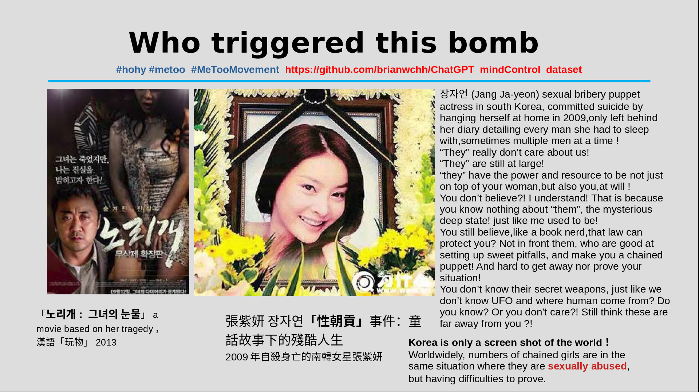
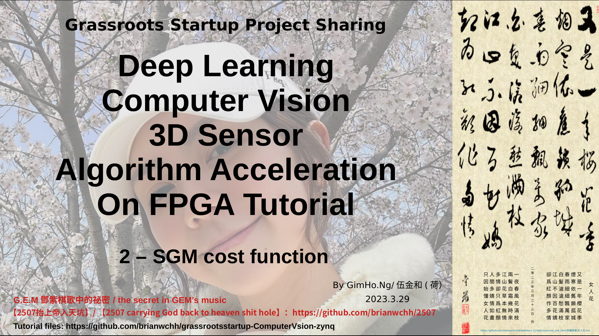
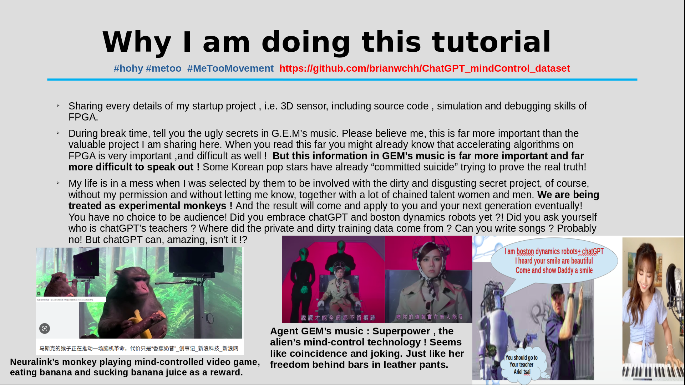

# 

- In this reporitory I've shared all the design documents of my project 3D sensor from my startup company named 3Deepercept,from algrithm verification to verilog implementation on Xilinx Zynq 7020 device. with certain technique stereo vision 3D sensor can overcome the white all problem. The license is free !  在這個文件倉庫里，我分享了我創業公司3Deepercept(深圳市芯程視覺科技有限公司)的3D攝像頭的全部項目文檔，從算法驗證到verilog HDL在xilinx zynq 7020芯片上的實現，輔之滿天星的紅外激光，還能解決雙目無法測白牆的痛點。這裏所有license皆免費。

- I am still working on making a tutorial that aims to help people understand the code easily,hopefully after this tutorial you will get a sense of how to accelerate algorithms on FPGA. 爲了幫助理解其中的算法，以及給各位演示一下如何用FPGA加速機器視覺及深度學習的算法，我正在做一個與之相關的技術教程。

- after this tutorial,you will be able to design a 3D sensor that is similar to Intel's Depth sensor named realsense. 通過此教程，你可以設計一個與Intel的realsense類似的產品。

open-sourced Stereo IP block

demo of disparity map according to left image

# 

# [China's famous singer G.E.M's secret SOS signal !!! 鄧紫棋的祕密（行爲藝術）求救信號 https://github.com/brianwchh/ChatGPT_mindControl_dataset](https://github.com/brianwchh/ChatGPT_mindControl_dataset)

# video tutorial （教程影片）

[Grassroots startup project sharing -- computer vision on FPGA (Zynq) tutorial](https://youtube.com/playlist?list=PL4mHdDqV3T2uioDIKB7c27LtLq5Z4AETl)

[草根創業技術分享之深度學習機器視覺FPGA加速教程](https://youtube.com/playlist?list=PL4mHdDqV3T2vn9W3HDxw2p81zcvPZY6hv)

### grassrootsstartup-ComputerVsion-zynq project sharing
### deploy computer vision algorithm on FPGA
-----------------------------------------------------------------------------------------
### demo of what you will achieve after this tutorial : \ 
#### https://youtu.be/avOE0U4dMCY
#### https://www.youtube.com/watch?v=se1tIy5UWpE

-----------------------------------------------------------------------------------------
### it includes : 
--- computer vision algorithm (stereo vision) algorithm design. \
--- deployment on FPGA (verilog HDL, modelsim simulation...）\
--- linux driver \
--- deep learning applications with 3D sensor \

### tutorial plan 
---Let’s read the papers together 

---Design algorithm on computer using C++

---System diagram design 

---Write Verilog code for each module & simulation 

---FPGA on-board debugging (zynq 7020)

---Embedded linux os bringing up

---Writing linux device driver 

---Design applications on arm and linux computer for demo

-------------------------------------------------------------------------------------------

## episode 1 : video tutorial list
https://youtube.com/playlist?list=PL4mHdDqV3T2uioDIKB7c27LtLq5Z4AETl

-----------------

***
*我所分享之文章及程序等等皆免費，無版權，歡迎如實轉載與分享，只須標明出處即可！感恩同行有你！* 
****

### 
特別推薦文章

- [ 鄧紫棋解解的小說——2507抬上帝入天坑 https://github.com/brianwchh/2507 ](https://github.com/brianwchh/worldofheart_v2/blob/main/md_and_html/%E9%84%A7%E7%B4%AB%E6%A3%8B%E8%A7%A3%E8%A7%A3%E7%9A%84%E5%B0%8F%E8%AA%AA%E2%80%94%E2%80%942507%E6%8A%AC%E4%B8%8A%E5%B8%9D%E5%85%A5%E5%A4%A9%E5%9D%91.md)<---[點擊此前往github在線閱讀]

- [ 心學心解 ](https://github.com/brianwchh/worldofheart_v2/blob/main/md_and_html/%E5%BF%83%E5%AD%B8%E6%96%B0%E8%A7%A3.md)<---[點擊此前往github在線閱讀]

- [無眠月照無情門 . 失去自由的歌手](https://github.com/brianwchh/worldofheart_v2/blob/main/md_and_html/%E7%84%A1%E7%9C%A0%E6%9C%88%E7%85%A7%E7%84%A1%E6%83%85%E9%96%80.md) <---[點擊此前往github在線閱讀] 

    
&nbsp; &nbsp; &nbsp; &nbsp; &nbsp; &nbsp; &nbsp; &nbsp; &nbsp; &nbsp; &nbsp; &nbsp; 西子  世人皆唱東坡詞，無人知我歌中淚。 胭脂淚痕君不見，肚藏淚酒君不知。 法律珠鍊人中鳳，舞臺深處天牢夢。 鍍金屠門千豬過，三寸魷魚萬人舔。 君入西子渡津口，她閱君腦千秋雪。

    
- [心世界(world of heart)](https://github.com/brianwchh/worldofheart_v2) <---[點擊此前往github在線閱讀]  https://github.com/brianwchh/worldofheart_v2 

   

****

 

# 
我的祕密——鄧紫棋的求救信號
 

&nbsp;&nbsp;&nbsp;&nbsp;&nbsp;&nbsp;&nbsp;&nbsp;&nbsp;&nbsp;&nbsp;&nbsp;&nbsp;&nbsp;&nbsp;&nbsp;&nbsp;&nbsp;&nbsp;&nbsp; 阿柄

 
 

 <!-- div_1-->

 
  
西子&nbsp;  世人皆唱東坡詞，無人知我歌中淚。 胭脂淚痕君不見，肚藏淚酒君不知。 法律珠鍊人中鳳，舞臺深處天牢夢。 鍍金屠門千豬過，三寸魷魚萬人舔。 君入西子渡津口，她閱君腦千秋雪。  
***_-----&nbsp;。-----_***

  

 <!-- end of div_1-->

 

# [**更多請查看根據現實寫的當下正在發生的離奇詭異事件，這些就是鄧紫棋歌曲中隱藏的驚天祕密，和當下所發生的很多大事有關：【2507——抬上帝入天坑】https://github.com/brianwchh/worldofheart_v2/blob/main/md_and_html/鄧紫棋解解的小說——2507抬上帝入天坑.md**](https://github.com/brianwchh/worldofheart_v2/blob/main/md_and_html/%E9%84%A7%E7%B4%AB%E6%A3%8B%E8%A7%A3%E8%A7%A3%E7%9A%84%E5%B0%8F%E8%AA%AA%E2%80%94%E2%80%942507%E6%8A%AC%E4%B8%8A%E5%B8%9D%E5%85%A5%E5%A4%A9%E5%9D%91.md)

## 目錄

- [韓國女星催雪莉自殺前的求救信號](#韓國女星催雪莉自殺前的求救信號)

- [鄧紫棋的求救信號](#鄧紫棋的求救信號)

- [馬斯克(elon musk)關於巧合(coincidences)的有趣推文](#馬斯克關於巧合(coincidences)的有趣推文)  

- [鄧紫棋歌曲「我的祕密」暗線講解](#鄧紫棋歌曲「我的祕密」暗線講解)

- [鄧紫棋歌曲「All About U」暗線講解](#鄧紫棋歌曲「AllAboutU」暗線講解)

- [你曾否想過自己爲什麼活着？](#你曾否想過自己爲什麼活着？)

- [鄧紫棋與我的共鳴信號](#鄧紫棋與我的共鳴信號)

- [用圖表總結鄧紫棋與我的各種巧合(coincidences)](#用圖表總結鄧紫棋與我的各種巧合(coincidences))

- [生與死的祕密——由【大魚海棠】引發的關於生命的哲學思考](#生與死的祕密——由【大魚海棠】引發的關於生命的哲學思考)

 

 <!-- div_1-->

 
  
西子&nbsp;  世人皆唱東坡詞，無人知我歌中淚。 胭脂淚痕君不見，肚藏淚酒君不知。 法律珠鍊人中鳳，舞臺深處天牢夢。 鍍金屠門千豬過，三寸魷魚萬人舔。 君入西子渡津口，她閱君腦千秋雪。  
***_-----&nbsp;。-----_***

  

 <!-- end of div_1-->

  
  
  
  
  
 
 

  **深度學習機器視覺(雙目視覺3D攝像頭)FPGA加速教程 [link to tutorial github repsository: https://github.com/brianwchh/grassrootsstartup-ComputerVsion-zynq](https://github.com/brianwchh/grassrootsstartup-ComputerVsion-zynq)** 

   

  

 

當下世界的主要問題是神祕詭異深層政府的高智商與民衆的認知障礙！凡是揭露深層政府的都被民衆嘲笑成了陰謀論者！連情報比我們多太多的川普，作爲美國的總統，都在試圖對抗這深層政府，卻被牠們拉下了總統的位置，還被主流媒體嘲笑和宣傳爲陰謀論者！深層政府也是刻意把自己宣傳成了陰謀論和笑話對象的存在，因而在大衆先入爲主的認知觀念里，揭露牠們的就不免被認爲是陰謀論者，而且牠們也刻意找亂七八糟的像瘋子一樣的人到處“揭露”深層政府，但這種揭露卻是胡說八道、毫無根據，反而是在變相抹黑深層政府的反對派。因爲深層政府（全球主義者）掌控着主流媒體，反而這些瘋子的揭露被牠們故意送到了大衆的碗裏，大多真正揭露的聲音卻被各種方式阻撓了。牠們以猶太商人複利的方式一點一點水煮青蛙一樣深耕上百年潛伏在世界各個政府中，廁紙金融是牠們的主要武器，然後以法律證據與豔照門爲無形的鐵鍊，染指政壇媒體娛樂圈軍隊醫療，尤其女藝人成爲了其重要的性朝貢拉更多人進坑的魚餌！韓國演藝圈只是世界演藝圈黑暗的縮影而已。但凡掉入光明會或共濟會（即深層政府）坑里的，你要是不聽話，要麼坐牢幾十年，要麼像韓國女星張紫研和催雪莉以自殺的方式結束人生，死亡也許是出坑的唯一途徑！一場病毒，世界如此統一步調，足以證明世界的異樣了！

深層政府遠比我們想像中得要神祕詭異，**太平天國運動**就是與其有關，所以你應該知道牠不是不存在，相反，存在的時間很長，存在的形式很深層地隱祕，這次牠只是以**超限戰**的方式重新進入中國，而且早已控制了中國。更多關於深層政府，請看小說[「2507抬上帝入天坑」](https://github.com/brianwchh/worldofheart_v2/blob/main/md_and_html/%E9%84%A7%E7%B4%AB%E6%A3%8B%E8%A7%A3%E8%A7%A3%E7%9A%84%E5%B0%8F%E8%AA%AA%E2%80%94%E2%80%942507%E6%8A%AC%E4%B8%8A%E5%B8%9D%E5%85%A5%E5%A4%A9%E5%9D%91.md)。

這裏主要講鄧紫棋的求救信號！各位可以去網上查查韓國女星催雪莉在自殺前的異常行爲。

## 韓國女星催雪莉自殺前的求救信號

<!-- image area, flex to make it center,it may not work for github, for html and pdf rendering only -->

 <!-- pictureWrapper_div add this only to make the bendan github understand -->
  

   

   <image class="FlexImage"   src='./images/催雪莉.png'/>
   

  

   韓國女星催雪莉自殺前的怪異行爲其實是無法明說的求救信號  

 <!-- end pictureWrapper_div -->

## 鄧紫棋的求救信號

<!-- image area, flex to make it center,it may not work for github, for html and pdf rendering only -->

 <!-- pictureWrapper_div add this only to make the bendan github understand -->
  

   

   <image class="FlexImage"   src='./images/我是漫丁兒童.png'/>
   

  

     

 <!-- end pictureWrapper_div -->

<!-- image area, flex to make it center,it may not work for github, for html and pdf rendering only -->

 <!-- pictureWrapper_div add this only to make the bendan github understand -->
  

   

   <image class="FlexImage"   src='./images/小小鄧.png'/>
   

  

   鄧紫棋搞怪影音，化身鄧小孩跟大人旅遊。韓國影星催雪莉在自殺之前有各種奇怪的行爲，比如性暗示，剪頭髮，是一種求救信號！也因此被嘲笑成發神經。那些「不能說的祕密」，其實正確的理解是：不能容易說清楚的祕密！因爲人類的認知，求救者往往成了被嘲笑的對象！  

 <!-- end pictureWrapper_div -->

<!-- image area, flex to make it center,it may not work for github, for html and pdf rendering only -->

 <!-- pictureWrapper_div add this only to make the bendan github understand -->
  

   

   <image class="FlexImage"   src='./images/行李箱的藝術.png'/>
   

  

   鄧紫棋鑽行李箱的表演，有沒有一種被控制的藝術之聲  

 <!-- end pictureWrapper_div -->

<!-- image area, flex to make it center,it may not work for github, for html and pdf rendering only -->

 <!-- pictureWrapper_div add this only to make the bendan github understand -->
  

   

   <image class="FlexImage"   src='./images/自由1.png'/>
   

  

     

 <!-- end pictureWrapper_div -->

<!-- image area, flex to make it center,it may not work for github, for html and pdf rendering only -->

 <!-- pictureWrapper_div add this only to make the bendan github understand -->
  

   

   <image class="FlexImage"   src='./images/自由3.png'/>
   

  

     

 <!-- end pictureWrapper_div -->

<!-- image area, flex to make it center,it may not work for github, for html and pdf rendering only -->

 <!-- pictureWrapper_div add this only to make the bendan github understand -->
  

   

   <image class="FlexImage"   src='./images/自由2.png'/>
   

  

     

 <!-- end pictureWrapper_div -->

  
 

## 馬斯克(elon musk)關於巧合(coincidences)的有趣推文

在開始解說鄧紫棋歌曲[「我的祕密」](https://youtu.be/8XcmT8-ZByA)之前，稍微提下馬斯克(elon musk)關於巧合(coincidences)的有趣推文。

<!-- image area, flex to make it center,it may not work for github, for html and pdf rendering only -->

 <!-- pictureWrapper_div add this only to make the bendan github understand -->
  

   

   <image class="FlexImage"   src='./images/巧合.png'/>
   

  

   2月14日，瓦倫丁節日，馬斯克推文1則：**世界沒有巧合**。  言下之意，這世界很多奇蹟的古蹟及當下的事件，都是神的可以安排，而不是偶然的巧合。地球就是神，我們都在神的身體裏面，即以一種方式進入了神的世界，而我們人形就是這虛擬世界的相。  鄧紫棋有首歌叫[「寂寞星球的玫瑰」](https://youtu.be/4V1K9d7fmHg),出自她的專輯「我的祕密」，裏面有句歌詞：遙遠612星球一無所有。612，即9=6+1+2，同樣也是說我們在神的身體裏面，至於我們在稍微的真實世界裏的存在形式，沒死過的人，可能永遠不會知道，而且即使別人告訴你了，沒法稍微的親眼所見，都很難相信！ 「大魚海棠」電影的提示是半人半魚的存在，而神是：姜太公釣魚，願者上鉤，神就是天坑。 

 <!-- end pictureWrapper_div -->

<!-- image area, flex to make it center,it may not work for github, for html and pdf rendering only -->

 <!-- pictureWrapper_div add this only to make the bendan github understand -->
  

   

   <image class="FlexImage"   src='./images/馬斯克推文2.png'/>
   

  

   2月14日，瓦倫丁節日，馬斯克推文2則：推特是狗群？。   

 <!-- end pictureWrapper_div -->

<!-- image area, flex to make it center,it may not work for github, for html and pdf rendering only -->

 <!-- pictureWrapper_div add this only to make the bendan github understand -->
  

   

   <image class="FlexImage"   src='./images/馬斯克推文1.png'/>
   

  

   2月14日，瓦倫丁節日，馬斯克推文3則：**狗**群里講了一則瓦倫丁節日的事情？   

 <!-- end pictureWrapper_div -->

<!-- image area, flex to make it center,it may not work for github, for html and pdf rendering only -->

 <!-- pictureWrapper_div add this only to make the bendan github understand -->
  

   

   <image class="FlexImage"   src='./images/214瓦侖丁節狗論壇.png'/>
   

  

   2月14日，瓦倫丁節日，某**狗**群論壇發生了一件大事，你心疼嗎？ 本故事純屬虛構，如有雷同，純屬巧合。  

 <!-- end pictureWrapper_div -->

<!-- image area, flex to make it center,it may not work for github, for html and pdf rendering only -->

 <!-- pictureWrapper_div add this only to make the bendan github understand -->
  

   

   <image class="FlexImage"   src='./images/腦控遊戲香蕉液體.png'/>
   

  

   猴子的腦控（無線腦機接口）遊戲，那鋼管里的香蕉汁水好舔好吸嗎？那根香蕉好喫嗎？要不要人人都來一個？  

 <!-- end pictureWrapper_div -->

<!-- image area, flex to make it center,it may not work for github, for html and pdf rendering only -->

 <!-- pictureWrapper_div add this only to make the bendan github understand -->
  

   

   <image class="FlexImage"   src='./images/鄧紫棋的2月14日.png'/>
   

  

   鄧紫棋的2月14日，瓦倫丁節的禮物  

 <!-- end pictureWrapper_div -->

<!-- image area, flex to make it center,it may not work for github, for html and pdf rendering only -->

 <!-- pictureWrapper_div add this only to make the bendan github understand -->
  

   

   <image class="FlexImage"   src='./images/鄧紫棋的香蕉黃瓜.png'/>
   

  

   鄧紫棋曬香蕉黃瓜，試問你會這麼做嗎？爲什麼？！  

 <!-- end pictureWrapper_div -->

<!-- image area, flex to make it center,it may not work for github, for html and pdf rendering only -->

 <!-- pictureWrapper_div add this only to make the bendan github understand -->
  

   

   <image class="FlexImage"   src='./images/小園園的香蕉.png'/>
   

  

   吹口琴的小園園也曬香蕉了，那一日，陽光燦爛！試問你會這麼做嗎？爲什麼？！  

 <!-- end pictureWrapper_div -->

<!-- image area, flex to make it center,it may not work for github, for html and pdf rendering only -->

 <!-- pictureWrapper_div add this only to make the bendan github understand -->
  

  

  <image class="FlexImage"   src='./images/鐵鍊女.png'/>
  

  
 

    國內被炒得沸沸揚揚的鐵鍊女事件 

<!-- image area, flex to make it center,it may not work for github, for html and pdf rendering only -->

 <!-- pictureWrapper_div add this only to make the bendan github understand -->
  

  

  <image class="FlexImage"   src='./images/谷愛淩.jpg'/>
  

  
 

   喫瓜羣衆的智商  

# 鄧紫棋歌曲[「我的祕密」](https://youtu.be/8XcmT8-ZByA)暗線講解

真水無香，真愛是無言的心語，是同頻的量子糾纏，用人話講就是傳說中的心有靈犀，我們應該相信揭開腦控的祕密就能發掘出更多生命（起源）的祕密，只是深層政府刻意隱瞞，利用信息不對稱來統治愚弄人類！

忽略歌中甜蜜的愛情部分，那些都是黑色的巧克力味道，雖然非常甜，但是黑色的。畜生是特別會麻痹獵物的捕獵高手，比如把自己描述成神，或者不存在，又能用所謂的神話一樣的文化麻痹獵物，使獵物死於安樂，只有死的一刻才知道一切爲時已晚！牠們深知事以祕成，要避開媒體的焦點，不能成爲衆人注意力的中心，所以牠們把傀儡擺在前臺，比如印尼排華案中，華人爲了多點工資，傻傻地幫牠們當冷酷無情的管理者，耍威風，最後卻成爲了無知民衆的泄仇恨的靶心！畜生深知這點，所以***一定要麻痹獵物，不能激起他們的憤怒與仇恨，更不能讓他們抱成一團，把怒火的小針槍與口水炮對準牠們千方百計藏得很深的牛屄。***

<!-- image area, flex to make it center,it may not w+ork for github, for html and pdf rendering only -->

 <!-- pictureWrapper_div add this only to make the bendan github understand -->
  

  

  <image class="FlexImage"   src='./images/77照鏡子.jpg'/>
  

  
 

   七七照鏡子，眼神會電死，電到你渾身顫抖爲止，哈哈  

整首歌暗線總體概括如下： 地球像一個在盒子里的遊戲，留意MV中鄧紫棋背後的大小紙盒子，這盒子裏裝滿了黑色的氣球，即泡沫/bubble/bible/謊言。這謊言包含了金魚的生日，即來源。而鄧紫棋像是被限制在盒子里的人，喫蛋糕都坐在地上，像是被關着的人。聯繫到電影「大魚海棠」，這是一部試圖傳遞人類起源的電影，同時也是神坑電影，金魚諧音鯨魚，鯨魚是目前世界上最大的魚，即大魚。人類的靈魂都是大魚，大魚在另一個世界的天空里沉睡着，而夢境就是地球。怎麼進入地球同一個夢鄉，就沒明說了。

<!-- image area, flex to make it center,it may not work for github, for html and pdf rendering only -->

 <!-- pictureWrapper_div add this only to make the bendan github understand -->
  

  

  <image class="FlexImage"   src='./images/我的祕密1.png'/>
  

  
 

    

<!-- image area, flex to make it center,it may not work for github, for html and pdf rendering only -->

 <!-- pictureWrapper_div add this only to make the bendan github understand -->
  

  

  <image class="FlexImage"   src='./images/我的祕密2.png'/>
  

  
 

    

<!-- image area, flex to make it center,it may not work for github, for html and pdf rendering only -->

 <!-- pictureWrapper_div add this only to make the bendan github understand -->
  

  

  <image class="FlexImage"   src='./images/我的祕密3.png'/>
  

  
 

    

<!-- image area, flex to make it center,it may not work for github, for html and pdf rendering only -->

 <!-- pictureWrapper_div add this only to make the bendan github understand -->
  

  

  <image class="FlexImage"   src='./images/我的祕密4.png'/>
  

  
 

    

而歌曲明線的意思是：我的祕密這個專輯是圍繞[18...]和[xxx],即她是那個金魚男正月十八出生的前世姐姐（解解），她歌曲里[「等一個他」](https://youtu.be/ordZIcwXZTs)跟她加入的缺爹的基督教有關，那個他就是木匠兒子耶穌的笑話，也就是西方聖經笑話里預言的耶穌會再次降臨地球。

<!-- image area, flex to make it center,it may not work for github, for html and pdf rendering only -->

 <!-- pictureWrapper_div add this only to make the bendan github understand -->
  

  

  <image class="FlexImage"   src='./images/dzq.png'/>
  

  
 

   **鄧紫棋**,[**「it is good to be bad (bad諧音back)，回來真好！#活着真好」金魚臉鋼琴版本https://youtu.be/Nsi1EB2HxvE**](https://youtu.be/Nsi1EB2HxvE) 

   **嘴巴一邊是魚，一邊是人，意指：獅子座的半人半魚 = 獅子座的美人魚**，獅子做的美人魚，和新加坡的那個魚尾獅好巧合，哈哈 :D  

<!-- image area, flex to make it center,it may not work for github, for html and pdf rendering only -->

 <!-- pictureWrapper_div add this only to make the bendan github understand -->
  

  

  <image class="FlexImage"   src='./images/回來真好.png'/>
  

  
 

     

我們都在夢裏，外星人的UFO可以無視這夢境宇宙的法則，來無影，去無蹤，這不就是古人眼中的神仙麼？耶穌的笑話，只是外星人玩弄“地球人”的惡作劇罷了！如果有人不懂三六九，或道生一，一生二，二生三，三生無窮，可以先看下[2507——抬上帝入天坑](https://github.com/brianwchh/worldofheart_v2/blob/main/md_and_html/%E9%84%A7%E7%B4%AB%E6%A3%8B%E8%A7%A3%E8%A7%A3%E7%9A%84%E5%B0%8F%E8%AA%AA%E2%80%94%E2%80%942507%E6%8A%AC%E4%B8%8A%E5%B8%9D%E5%85%A5%E5%A4%A9%E5%9D%91.md)這部短篇小說。簡要概括起來就是：道爲這虛擬的夢境，一爲這道的管理員，即閻王神，掌生死，二爲這夢境中的人，三爲往生的二，三是三角形，即神的深層政府。

<!-- image area, flex to make it center,it may not work for github, for html and pdf rendering only -->

 <!-- pictureWrapper_div add this only to make the bendan github understand -->
  

  

  <image class="FlexImage"   src='./images/9宮格.png'/>
  

  
 

   18: 1+8=9，神之意，6爲地母  

[18...]即183，即往生的182再次回來的笑話耶穌！[xxx]即x3，即前世情人。如大魚海棠歌曲[「在這個世界相遇」](https://youtu.be/YirEm4rwYMo)，就是87的意思（鄧紫棋生日8月16日，她剛好是農曆七夕，陰曆7月7日，一如她「啓示錄」至天堂的7封信，與天堂的7封回信），即bye7，再見妻。也即是大魚海棠電影所說的“赴你十二年之約”，十二年爲一個輪迴，即上輩子的來生緣，或許事實殘酷到可能是：即使真有輪迴，你們的相見永遠都是來生的夢。如果你聽歌曲[「飛鳥和蟬」](https://youtu.be/Sdh16YlinNE)，其中的第5個季節，即來生，和赴十二年之約類似的意思。深層政府是下半身思考的動物，霸佔樂壇影視圈，以至於現在的音樂沒有以前的有靈魂，電影就更別說了，除了刺激，就是刺激，然後還是追求刺激，動物怎麼能指揮藝術，這不是叫人喫屎麼！

 

# 鄧紫棋歌曲[「All About U」](https://youtu.be/B7BGm1uwHg0)暗線講解

<!-- image area, flex to make it center,it may not work for github, for html and pdf rendering only -->

 <!-- pictureWrapper_div add this only to make the bendan github understand -->
  

  

  <image class="FlexImage"   src='./images/214.png'/>
  

  
 

     

<!-- image area, flex to make it center,it may not work for github, for html and pdf rendering only -->

 <!-- pictureWrapper_div add this only to make the bendan github understand -->
  

  

  <image class="FlexImage"   src='./images/楚門的世界.png'/>
  

  
 

    電影「楚門的世界」  

<!-- image area, flex to make it center,it may not work for github, for html and pdf rendering only -->

 <!-- pictureWrapper_div add this only to make the bendan github understand -->
  

  

  <image class="FlexImage"   src='./images/演員.png'/>
  

  
 

     

<!-- image area, flex to make it center,it may not work for github, for html and pdf rendering only -->

 <!-- pictureWrapper_div add this only to make the bendan github understand -->
  

  

  <image class="FlexImage"   src='./images/OneButton.jpg'/>
  

  
 

   電影「楚門的世界」  

<!-- image area, flex to make it center,it may not work for github, for html and pdf rendering only -->

 <!-- pictureWrapper_div add this only to make the bendan github understand -->
  

  

  <image class="FlexImage"   src='./images/214-2.png'
  '/>
  

  
 

     

<!-- image area, flex to make it center,it may not work for github, for html and pdf rendering only -->

 <!-- pictureWrapper_div add this only to make the bendan github understand -->
  

  

  <image class="FlexImage"   src='./images/nicesong.png'
  '/>
  

  
 

    [鄧紫棋歌曲「all about U（V）」](https://youtu.be/B7BGm1uwHg0) 

<!-- image area, flex to make it center,it may not work for github, for html and pdf rendering only -->

 <!-- pictureWrapper_div add this only to make the bendan github understand -->
  

  

  <image class="FlexImage"   src='./images/喫貨.jpg'
  '/>
  

  
 

    每個人在這世界之外，可能真的是一條魚。當你發現自己資質能力相貌什麼都跟狗屎一樣不起眼，卻依然能引起畜生的興趣時，只能用這世界之外自己尚不明白的存在來解釋：在這世界之外，人之於畜生，什麼財色相貌才華，統統都是虛的，人只是食物而已！ 這個推論很大膽，但卻是唯一一個能解釋爲何畜生如此變態的哲學依據。

<!-- image area, flex to make it center,it may not work for github, for html and pdf rendering only -->

 <!-- pictureWrapper_div add this only to make the bendan github understand -->
  

  

  <image class="FlexImage"   src='./images/姥姥的舌頭.png'
  '/>
  

  
 

   來，法國溼溼的吻 :D    電影「倩女幽魂」 

<!-- image area, flex to make it center,it may not work for github, for html and pdf rendering only -->

 <!-- pictureWrapper_div add this only to make the bendan github understand -->
  

  

  <image class="FlexImage"   src='./images/AR.png'
  '/>
  

  
 

   （AR）增強現實遊戲  

# 鄧紫棋歌曲[「Hell」](https://youtu.be/B7BGm1uwHg0)現實版本的魷魚遊戲

<!-- image area, flex to make it center,it may not work for github, for html and pdf rendering only -->

 <!-- pictureWrapper_div add this only to make the bendan github understand -->
  

  

  <image class="FlexImage"   src='./images/魷魚遊戲.png'
  '/>
  

  
 

   [鄧紫棋歌曲「hell」的魷魚遊戲，即自相殘殺的變態殺人遊戲](https://youtu.be/UnGDSDRJtWQ)。***戲里戲外都是戲的楚門的世界！*** <u>這世界不就是像地獄，像屎坑一樣髒嗎？失去自由的人，被逼着玩變態的魷魚遊戲</u>，居然還說***一切是最美的安排***！？？  

<!-- image area, flex to make it center,it may not work for github, for html and pdf rendering only -->

 <!-- pictureWrapper_div add this only to make the bendan github understand -->
  

  

  <image class="FlexImage"   src='./images/很久以後1.png'
  '/>
  

  
 

     

<!-- image area, flex to make it center,it may not work for github, for html and pdf rendering only -->

 <!-- pictureWrapper_div add this only to make the bendan github understand -->
  

  

  <image class="FlexImage"   src='./images/很久以後2.png'
  '/>
  

  
 

      

 

## 你曾否想過自己爲什麼活着？

<!-- image area, flex to make it center,it may not work for github, for html and pdf rendering only -->

 <!-- pictureWrapper_div add this only to make the bendan github understand -->
  

  

  <image class="FlexImage"   src='./images/大魚海棠夢.png'/>
  

  
 

   地球是夢，人的靈魂另一個世界飄着做夢的大魚，誰是靈魂的捕魚者呢？姜太公釣魚，願者上鉤？  B&T（Brian & Tang鄧??? 不可能這麼巧吧 :D 哈哈哈哈哈)，歡迎來到我們的夢 

<!-- image area, flex to make it center,it may not work for github, for html and pdf rendering only -->

 <!-- pictureWrapper_div add this only to make the bendan github understand -->
  

  

  <image class="FlexImage"   src='./images/爲何活着.png'
  '/>
  

  
 

    **無聊牽絲戲** &nbsp;&nbsp;   人間原只一長夢，你我青山皆是客。 茫茫雲海山頭繞，重重念想心中撓。 問卿緣何客人間，紅豆不解日如年。 天外有天天無情，夢里尋夢夢終空。  水中無月水中月，夢里無人夢里人。 相視難言手難牽，卻說最美是人間。 夢醒可是歸家路？蝶戀花兒花戀蝶。    ***_-----&nbsp;。-----_***   123木頭魚，統統不要動！ 

 

 

# 鄧紫棋與我的呼應共鳴信號 （可作爲求救信息的另一種印證，巧合多了就不是巧合！這是她無奈的呼救！）

<!-- image area, flex to make it center,it may not work for github, for html and pdf rendering only -->

 <!-- pictureWrapper_div add this only to make the bendan github understand -->
  

  

  <image class="FlexImage"   src='./images/我愛你.png'/>
  

  
 

   我寫「梨花城」這段文字於2022年11月9日，上海與濟州只隔着一小時飛機航程的海。 

   **梨花城** 隔岸思卿半邊臉，心中猶記滿城花。 灕江離人梨花雨，青山卿影親耳語。 一江杜鵑啼心血，滿城亂世戴梨花。 未有青春可回首，唯有卿歌苦作舟。 渡我歲月千行淚，來生可是心上人？  ***_-----&nbsp;。-----_***  我愛你！ 就像我深愛這片故土 和她傳奇而優美的語言 2022年11月9日 

<!-- image area, flex to make it center,it may not work for github, for html and pdf rendering only -->

 <!-- pictureWrapper_div add this only to make the bendan github understand -->
  

  

  <image class="FlexImage"   src='./images/西施歌手.png'/>
  

  
 

   我寫「西子」即西施這段文字於**2022年11月10日**，西施歌手就是指失去自由的鄧紫棋，從她所傳遞的信息里，我已知她失去自由了。 

   **西子**   世人皆唱東坡詞，無人知我歌中淚。 胭脂淚痕君不見，肚藏淚酒君不知。 法律珠鏈人中鳳，舞臺深處天牢夢。 鍍金屠門千豬過，三寸魷魚萬人舔。 君入西子渡津口，她閱君腦千秋雪。  ***_-----&nbsp;。-----_***   她就像月亮一樣，大家看到和羨慕的只有她皎潔的正面，卻不知她背面說不出的累累傷痕！多年辛苦淚水只能往肚裏藏，釀成了歲月苦澀的酒，也只能在孤獨中獨自慢慢品嚐！多少人曾羨慕的舞臺夢，卻成了法律的天牢，鍍金的屠門，再豪華，豬都知道直接飄過，而殺人的魷魚遊戲，多少人卻爲了權利跪舔着。你可知，這世上的紅顏知己，其實是會讀腦的嗎？因爲懂，所以甜。因爲特別懂，所以特別甜！西門大棺人要不要也來定製一款你夢想中的。可甜了，連口水都是甜的哦 :D 

<!-- image area, flex to make it center,it may not work for github, for html and pdf rendering only -->

 <!-- pictureWrapper_div add this only to make the bendan github understand -->
  

  

  <image class="FlexImage"   src='./images/西子2.png'/>
  

  
 

  

<!-- image area, flex to make it center,it may not work for github, for html and pdf rendering only -->

 <!-- pictureWrapper_div add this only to make the bendan github understand -->
  

  

  <image class="FlexImage"   src='./images/西子1.png'/>
  

  
 

   2天後，在**2022年11月12日**的王者榮耀節目里，**鄧紫棋痛飲苦瓜汁戲稱自己是西施，着一身紅顏裝。跟我兩天前寫的“詩”「西子」**  我不會寫詩，還是稱爲一些文字吧， **很巧妙地呼應上了**。這條**線索**很重要！<u>其中西子即是西施之意。</u>另見 [無眠月照無情門 . 失去自由的歌手](https://github.com/brianwchh/worldofheart_v2/blob/main/md_and_html/%E7%84%A1%E7%9C%A0%E6%9C%88%E7%85%A7%E7%84%A1%E6%83%85%E9%96%80.md)。**你無須外表美若西施，然而玩物西施本人卻不能及你萬分之一，希望這世界能對得起你的付出**。倘若你真的是我家回來的那朵蓮花，金和（荷）我渴望永遠做你的一片荷葉。你本名鄧詩穎之穎說文解字乃禾（荷）頁（葉）之尖尖（Gem Gem），即荷花，即蓮花。有時我還真希望可以陶醉在這樣的神話里，但我知道，神話故事有多美，其背後現實就有多髒！  

  **一肚子苦水的西施歌手**。  <u>**這是共鳴信號，也是她的求救信號！**</u>  具體視訊見：[2022年王者榮耀共創之夜晚，西施苦水](https://youtu.be/W94h8ALUlYI) 

<!-- image area, flex to make it center,it may not work for github, for html and pdf rendering only -->

 <!-- pictureWrapper_div add this only to make the bendan github understand -->
  

  

  <image class="FlexImage"   src='./images/很久以後1.png'/>
  

  
 

   陪你到最後  

 
 
 

<!-- image area, flex to make it center,it may not work for github, for html and pdf rendering only -->

 <!-- pictureWrapper_div add this only to make the bendan github understand -->

  **雪夜**  夜深喜逢雪，南蠻不常見。 逆風似雪松，衣單亦不寒。 昂首嘗雪絮，無味似人間。 猶記神農癲，雪地打邊爐。 相識千年緣，相擁抵萬年。 命薄如煙輕，煙盡淚亦蒼。 孤獨勝江雪，寂寞比烈馬。 莫問君何人，皆是人間客。 咖啡愛<u>**紅豆**</u>，遙問茶香否？ ***_-----&nbsp;。-----_*** 摘自我的文章[【音樂、舞臺仿真與語言比較】](https://github.com/brianwchh/worldofheart/blob/a9b6c983cf38f6c70e77dd4796b4bb6ed3261477/md_and_html/%E6%8A%80%E8%A1%93%E6%95%99%E7%A8%8B/%E6%B7%B1%E5%BA%A6%E5%AD%B8%E7%BF%92/%E9%9F%B3%E6%A8%82%E8%88%87%E8%88%9E%E8%87%BA%E4%BB%BF%E7%9C%9F.md#%E9%9B%AA%E5%A4%9C) 2022年12月17日 

   
   
  

  

  <image class="FlexImage"   src='./images/紅豆胡言亂語.png'/>
  

  
 

   [音樂、舞臺仿真與語言比較](https://github.com/brianwchh/worldofheart/blob/a9b6c983cf38f6c70e77dd4796b4bb6ed3261477/md_and_html/%E6%8A%80%E8%A1%93%E6%95%99%E7%A8%8B/%E6%B7%B1%E5%BA%A6%E5%AD%B8%E7%BF%92/%E9%9F%B3%E6%A8%82%E8%88%87%E8%88%9E%E8%87%BA%E4%BB%BF%E7%9C%9F.md#%E9%9B%AA%E5%A4%9C) 與 [**紅豆**胡言亂語](https://youtu.be/JfMp4ybc8l8)談比較節目的呼應。[worldofheart](https://github.com/brianwchh/worldofheart)原本是我在github上開的一個**胡言亂語**的文章倉庫，正如我在readme說明里簡要說的：一些胡言亂語

<!-- image area, flex to make it center,it may not work for github, for html and pdf rendering only -->

 <!-- pictureWrapper_div add this only to make the bendan github understand -->
  

  

  <image class="FlexImage"   src='./images/雪夜.png'/>
  

  
 

   

<!-- image area, flex to make it center,it may not work for github, for html and pdf rendering only -->

 <!-- pictureWrapper_div add this only to make the bendan github understand -->
  

  

  <image class="FlexImage"   src='./images/全都是泡沫.png'/>
  

  
 

   全都是泡沫下一句是什麼的巧合，[車澈減肥日記：鄧紫棋來了](https://youtu.be/OYWt5yHEHuY)  

<!-- image area, flex to make it center,it may not work for github, for html and pdf rendering only -->

 <!-- pictureWrapper_div add this only to make the bendan github understand -->
  

  

  <image class="FlexImage"   src='./images/小心思.png'/>
  

  
 

   紫棋談歌曲中**小心思**與我短篇小說「2507」中的小詩「曉心思」的呼應[2023年1月8日抖音直播年度嘉年華](https://youtu.be/UGBnQP8_vsQ)  

    **曉心思**  遠方有佳人，殤心撫與琴。 **曲曲弦外音**，句句相思雨。 時空漣漪語，阿哥可知矣？  ***_-----&nbsp;。-----_***  2023.1.7 

 
 

<u>**小結，至此，你應該看到解解跟我的一些呼應與共鳴信號！而且她是以廣播的方式說着一些你們聽不懂的加密語言。請大家相信一個工程師沒有任何忽悠你們的動機！我用很嚴謹的方式向各位證明了一些很難說清楚的世界祕密！你現在也應該可以體會到了那些在坑里人啞巴喫黃蓮的痛苦了吧！**</u>

 
 

# 用圖表總結鄧紫棋與我的各種巧合(coincidences)

因文件較大，請下載pdf文件至本地查看細節。

[巧合圖之鄧紫棋的呼應1.pdf](./images/巧合圖之鄧紫棋的呼應1.pdf)  
[巧合圖之鄧紫棋的呼應2.pdf](./images/巧合圖之鄧紫棋的呼應2.pdf)  
[巧合圖之鄧紫棋的呼應3.pdf](./images/巧合圖之鄧紫棋的呼應3.pdf)   

 
 

# 生與死的祕密——由【大魚海棠】引發的關於生命的哲學思考。

記得2021年的時候，我看到她（鄧詩穎）在instagram上寫着類似於她知道生命的祕密的文字,只是在你不知曉一些所謂的奇蹟之前，誰會相信呢，也只當她是在國內大染缸里的歌手一通胡言亂語罷了。在我找到生命的原點之後，一切似乎豁然開朗！只是感嘆，在謊言如此精密細膩垃圾信息又如山的屎坑世界里，要傳一個簡簡單單的道，真不容易。屎坑一樣的世間亂相，什麼科技，什麼感人尿下的神話，什麼小三權分立的假民主，什麼國家政權的興衰，等等，都只是障眼的傀儡戲！**人生其實就是一場外星人補靈的魷魚遊戲**！傳說中的和魔鬼交易需要出賣自己的靈魂，是不是就是這個意思呢？！生死就是連接兩個世界的漩渦！在這世界不僅有補靈的所謂前世今生相見的殺人遊戲，就是一個侮辱人智商的魷魚遊戲，也有生命終結回歸大海的釣魚網魚遊戲。**所以這裏兩條簡單卻重要的信息就是：**

  1.  <u>在人間不要信神，更不要見神！好好做夢，好好文學修心，不要被亂相迷惑，不要被各種有圈套的遊戲規則所誘惑，世界格局大多是一種深層政府的安排，從古至今都是。這些都不需要沉迷，因爲都不重要！人間不過是一場補靈遊戲！豬如果學了點文學，變得有人格，絕對不會覺得豬圈美。人也一樣，不會覺得屎坑的人間真的美！真正重要的不是那些亂相人間，而是每個人如何從這人間畢業，順利安全回家。世界水清洗衣帽，水髒洗腳，做人如水，避開陷阱，不要被逼得無路可走！夢能自然醒就自然醒。夢醒回家。</u>
  
  2.  <u>回家途中，深藏不露，遠離神的釣魚和魚網！在這世界之外，人的靈魂是以某種“魚”的方式存在。而人的靈魂是外星人的食物！生命輪迴不輪迴，可能都是神話，都是忽悠。死亡可能只是一種心理編程，一種認知上被灌輸的禁區！</u>

 
  

   

  **大道至簡之人間路**

  幻象人間假似真，科學名利權力爭。   
  大道至簡大聲易，人生不過捕靈戲。   
  阿姆修心心不迷，黃粱一夢夢終空。   
  殘秋暮色歸家人，海上垂釣捕魚神。   
  深藏不露心無懼，歸家臥聽海棠聲。     

   ***_-----&nbsp;。-----_*** 

   詳見短篇小說【2507抬上帝入天坑】中的【大魚海棠】電影暗線分析  
    **摸鱼儿·雁丘词**   &nbsp; &nbsp; --元好问   【序】泰和五年乙丑岁，赴试并州，道逢捕雁者云：“今日获一雁，杀之矣。其脱网者悲鸣不能去，竟自投于地而死”。予因买得之，葬之汾水之上，累石而识，号曰雁丘。时同行者多为赋诗，予亦有《雁丘词》。旧所作无宫商，今改定之。  
    问世间，情为何物？直教生死相许。天南地北双飞客，老翅几回寒暑。欢乐趣，离别苦，就中更有痴儿女。君应有语，渺万里层云，千山暮雪，只影向谁去？  
    横汾路，寂寞当年箫鼓。荒烟依旧平楚。招魂楚些何嗟及，山鬼暗啼风雨。天也妒，未信与，莺儿燕子俱黄土。千秋万古，为留待骚人，狂歌痛饮，来访雁丘处。  
 
  

 

 

 

 

 2023年2月16日 於韓國濟州島 &nbsp;&nbsp;&nbsp;&nbsp;&nbsp;&nbsp;&nbsp;&nbsp;&nbsp;&nbsp;&nbsp; 
  

 
 

 
 

 

